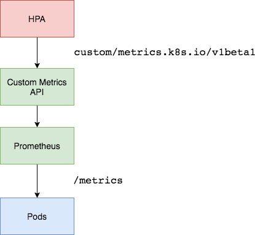

# Kubernetes HPA, Metricas customizadas, y prometheus

Aqui se cubre cómo almacenar métricas personalizadas con prometheus y cómo usarlo para escalar con el escalador automático de pod horizontal en Kubernetes

Descripción general de la arquitectura
--------------------------------------

Usamos el adaptador de Prometheus para extraer métricas personalizadas de nuestra instalación de Prometheus y luego dejamos que el escalador automático de pods horizontal (HPA) lo use para escalar los pods hacia arriba o hacia abajo.



Adjustar  el servidor de muestra
--------------------------------

Primero, cambiamos el servidor 'main.py' (Prometheus cliente) de tal manera que se pueda instrumentar las metricas que prometheus tiene que recolectar incluyendo datos a que namespace y pods de Kubernetes estamos instrumentando.

- Probamos los cambios activando el entorno virtual de python en la terminal, navegando hasta la raíz del proyecto y luego en el archivo "app" y ejecutando:

```console
>> pip install -r requirements.txt  <-- prometheus-client has been added
>> python main.py
```

- Prueba que el servidor esta funcianando correctamente en tu navegador:
`[http://localhost:8000](http://localhost:8000)`
Si funciona tendras un mensaje como:
`Respuesta de:   "laptop-jaime processing time: 1603020844.3325272"`

- Prueba que el servidor esta produción metricas para colectar en prometheus:
`[http://localhost:8000/metrics](http://localhost:8000/metrics)`
Si funciona tendras un mensaje como:

```console
# HELP slpocapp_request_operations_total The total number of processed requests
# TYPE slpocapp_request_operations_total counter
slpocapp_request_operations_total{namespace="default",pod="laptop-jaime"} 1.0
# HELP slpocapp_request_operations_created The total number of processed requests
# TYPE slpocapp_request_operations_created gauge
slpocapp_request_operations_created{namespace="default",pod="laptop-jaime"} 1.6030208443325655e+09
# HELP slpocapp_request_duration_seconds Histogram for the duration in seconds.
# TYPE slpocapp_request_duration_seconds histogram
slpocapp_request_duration_seconds_bucket{le="1.0",namespace="default",pod="laptop-jaime"} 1.0
slpocapp_request_duration_seconds_bucket{le="2.0",namespace="default",pod="laptop-jaime"} 1.0
slpocapp_request_duration_seconds_bucket{le="5.0",namespace="default",pod="laptop-jaime"} 1.0
slpocapp_request_duration_seconds_bucket{le="6.0",namespace="default",pod="laptop-jaime"} 1.0
slpocapp_request_duration_seconds_bucket{le="10.0",namespace="default",pod="laptop-jaime"} 1.0
slpocapp_request_duration_seconds_bucket{le="+Inf",namespace="default",pod="laptop-jaime"} 1.0
slpocapp_request_duration_seconds_count{namespace="default",pod="laptop-jaime"} 1.0
slpocapp_request_duration_seconds_sum{namespace="default",pod="laptop-jaime"} 0.0011820793151855469
# HELP slpocapp_request_duration_seconds_created Histogram for the duration in seconds.
# TYPE slpocapp_request_duration_seconds_created gauge
slpocapp_request_duration_seconds_created{namespace="default",pod="laptop-jaime"} 1.6030208443325946e+09
```
Desplegar el servidor como un contenedor en Kubernetes
------------------------------------------------------

- Primero construimos la imagen del contenedor y empujamos al repository de docker hub:

```console
>> docker build -t jseoane/slpocapp:latest .
>> docker push jseoane/slpocapp
```
La imagen empujada a docker hub is la que Kubernetes necesita bajar cuando se este creando un despliego en el cluster con un "Deployment

- Comenzamos Kubernetes minikube y su correspondiente dashboard:

```console
>> minikube start
>> minikube dashboard &> dashboard.out &
>> cd ../k8s
>> kubectl apply -f deployment.yaml
>> kubectl apply -f service.yaml
>> minikube tunnel &> tunnel.out &
>> kubectl get deploy app
>> kubectl get pods
>> kubectl get svc app-service
>> minikube service app-service
```
Si todo fue bien, se despliega la application en dos pods en un contenedor en cada uno. Tambien se habilita un distribuidor de cardo (loadbalancer) y se able la applicación en el navegador.

- verificamos que la application funciona y que metricas se estan exponiendo:

```console
http://<app-service external IP>/
http://<app-service external IP>/metrics
```
 


desplemgamos aplicación de muestra sobre la que probaremos nuestro ajuste de escala automático de métricas de Prometheus. Podemos usar el manifiesto a continuación para hacerlo:

    Add aliases to /ect/hosts for simple access:

    Determine actual ip with minikube ip

192.168.99.100  minikube.local prometheus.local alertmanager.local grafana.local

* Install Helm

curl https://raw.githubusercontent.com/kubernetes/helm/master/scripts/get-helm-3 > get_helm.sh
chmod 700 get_helm.sh
./get_helm.sh

>> minikube addons enable metrics-server

Installed Prometheus Operator from [Bitnami repos](https://bitnami.com/stack/prometheus-operator/helm) and the charts details including kubernetse manifests can be found in GitHub [here](https://github.com/bitnami/charts/tree/master/bitnami/kube-prometheus) and in the local repo in thel helm folder.

Add bitname repo to helm
>> helm repo add bitnami https://charts.bitnami.com/bitnami

Install Prometheous Operator in Minikube:
>> helm install my-release bitnami/kube-prometheus

Run to enable access to Prometheus Dashboard from outside cluster:
>> echo "Prometheus URL: http://127.0.0.1:9090/"
>> kubectl port-forward --namespace monitoring svc/prometheus-kube-prometheus-prometheus 9090:9090

Run to enable access to Prometheus Alert Manager Dashboard from outside cluster:
>> echo "Alertmanager URL: http://127.0.0.1:9093/"
>> kubectl port-forward --namespace monitoring svc/prometheus-kube-prometheus-alertmanager 9093:9093

Added prometheus-client to python requirements dependencies


RESOURCES:
[Digital Ocean - How To Set Up a Kubernetes Monitoring Stack with Prometheus, Grafana and Alertmanager on DigitalOcean](https://www.digitalocean.com/community/tutorials/how-to-set-up-a-kubernetes-monitoring-stack-with-prometheus-grafana-and-alertmanager-on-digitalocean#step-6-%E2%80%94-configuring-the-monitoring-stack-optional)
[RedHat - An introduction to installing Prometheus with Minikube](https://www.redhat.com/sysadmin/installing-prometheus)
[github - prometheus-grafana-on-minikube](https://github.com/baralc/prometheus-grafana-on-minikube)